# Procesverslag
**Auteur:** Lara Kiwiet

Markdown cheat cheet: [Hulp bij het schrijven van Markdown](https://github.com/adam-p/markdown-here/wiki/Markdown-Cheatsheet). Nb. de standaardstructuur en de spartaanse opmaak zijn helemaal prima. Het gaat om de inhoud van je procesverslag. Besteedt de tijd voor pracht en praal aan je website.

## Bronnenlijst
1. https://www.carhartt-wip.com/en
2. https://css-tricks.com
3. https://www.rapidtables.com/web/html/html-codes/
4. https://validator.w3.org/
5. dlo

## Herkansing

Voor de herkansing heb ik nog best veel gedaan. Ik heb ervoor gezorgd dat producten hovers hebben  gekregen met een bepaalde tekst zodat , je in principe, naar het product of de categorie kunt gaan van de afbeelding. Ik heb ook erg lang met javascript lopen sparren om een slideshow te maken op de eerst pagina voor de banner. Ook is de header iets verfijnder met het menu en het winkelkarretje.

Omdat Je vorige keer nog niet kon tabben heb ik dit nu ook toegevoegd en kun je bijna door alles heen tabben. Ik heb de footer ook verfijnder gemaakt en staat nu mooi onder elkaar. Ook de menubalk is nu sticky zodat je die altijd kunt bereiken zonder te scrollen.

Sommige elementen die nog niet helemaal goed responsive zijn heb ik nu kunnen fixen, zoals het ontzichtbare grid die ergens stond?!

-screenshot(s) van je eindresultaat-
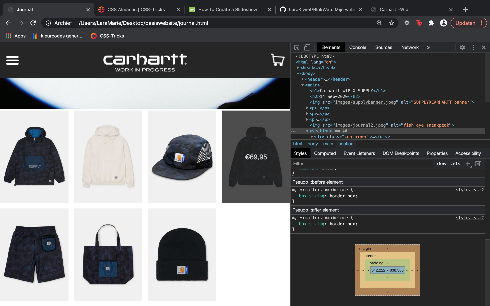
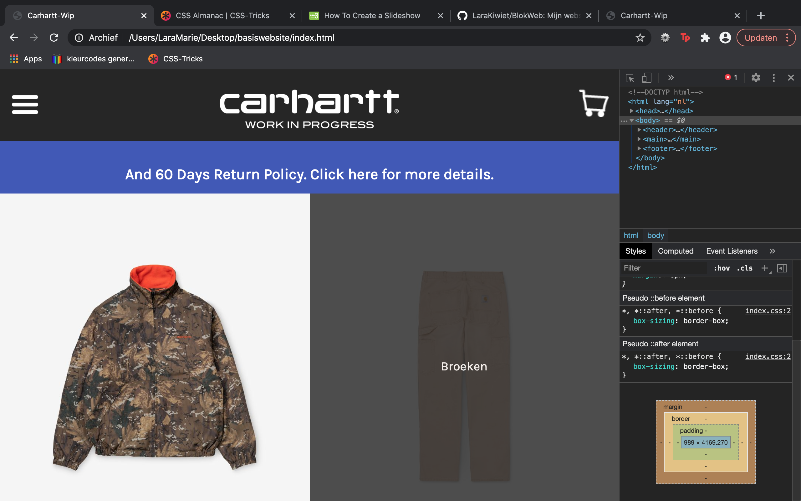
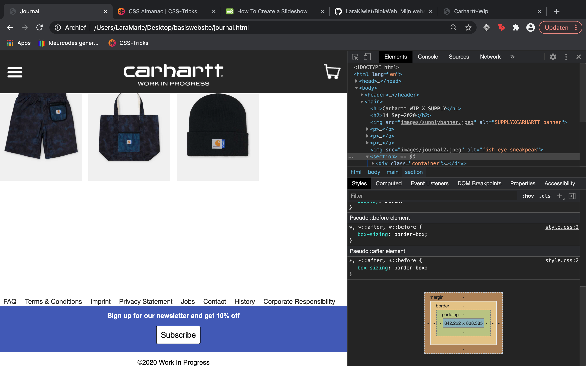

## Eindgesprek (week 7/8)

Alles ging volgens plan totdat mijn css helemaal in de soep liep, ik heb besloten om de css voor mijn index opnieuw te schijven en deze nu in een los css bestand te maken. Hierdoor ben ik veel tijd verloren. Al met al ging het goed en ben ik redelijk tevreden met het eindresultaat Als ik 1 dag meer had gehad was het zodal ik het zou willen. Deze week heb ik ook pas alles responsive gemaakt omdat ik eerst wilde dat alles klopte.

-screenshot(s) van je eindresultaat-
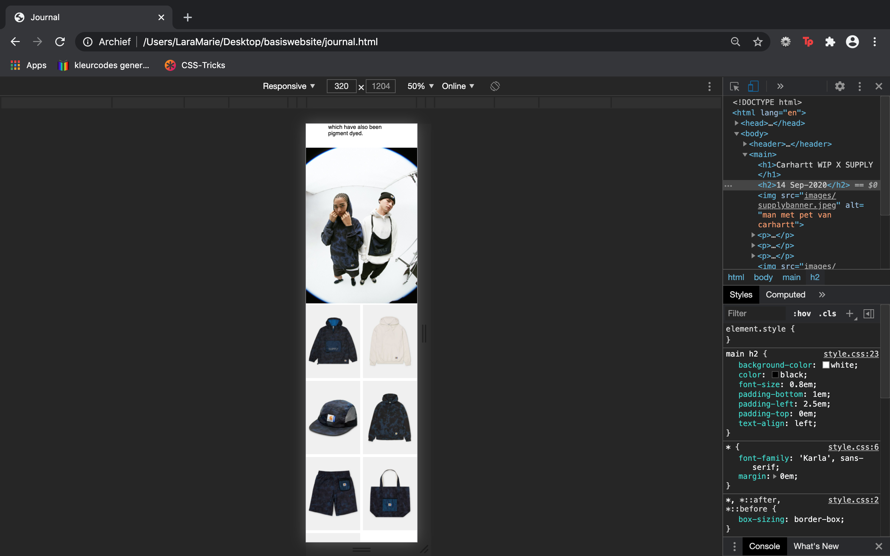
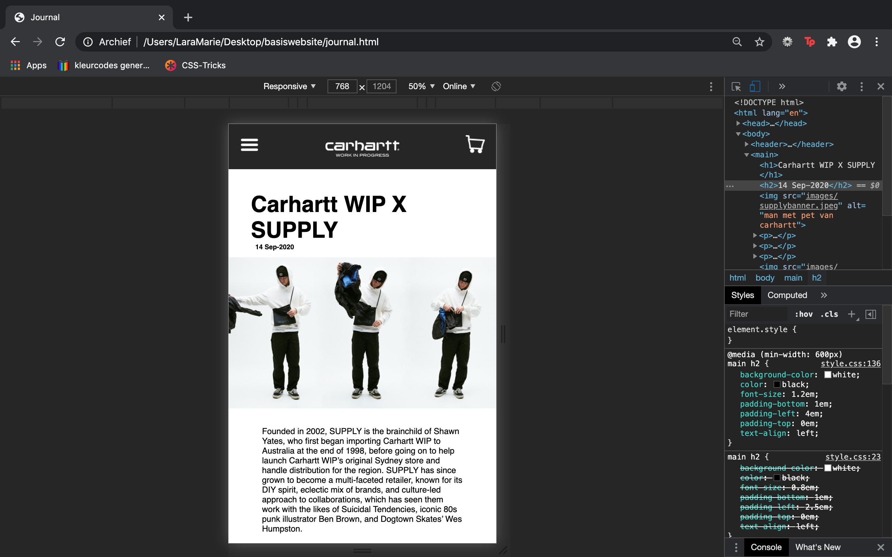
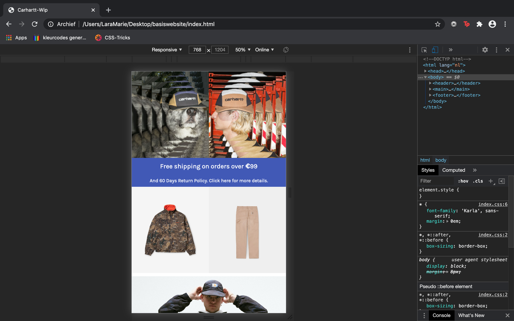
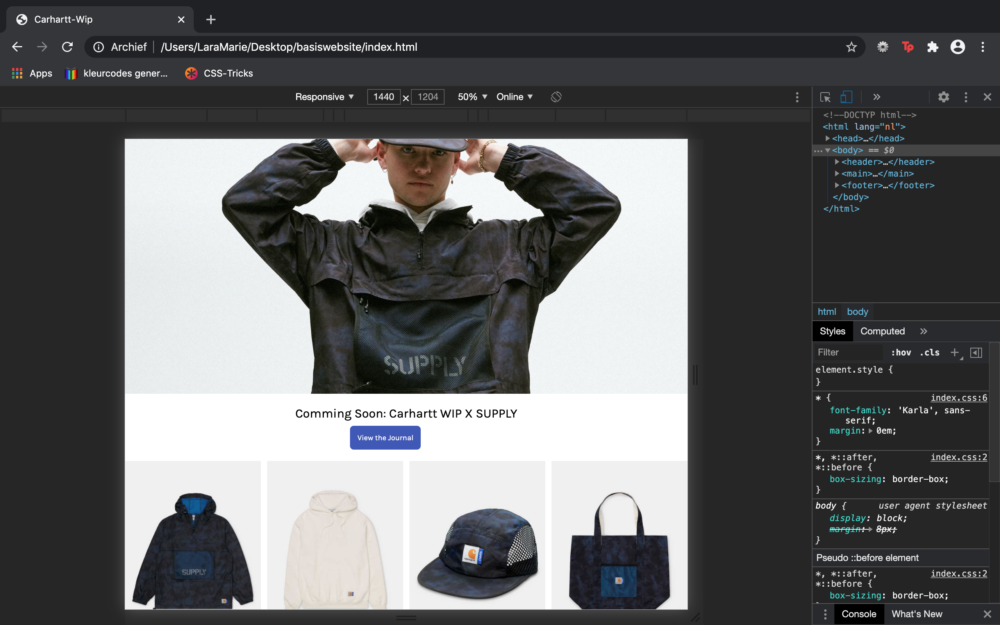

## Voortgang 3 (week 6)
### Stand van zaken
Deze week had ik iets minder gedaan dan de vorige weken, wel had beide pagina's mooi met css voorzien, naast een paar kleine elementen. 

**Screenshot(s):**

### Agenda voor meeting
Grids
Feedback
Specifieke vragen van Marlene en Anousha, ik had er op het moment geen.

### Verslag van meeting
Nieuwe tricks geleerd met klikken en automatisch omhoog scrollen

## Voortgang 2 (week 5)

### Stand van zaken
Deze week ben ik begonnen aan mijn tweede pagina en hier , tevens voor pagina 1 ook, alle content erin gezet die ik erin wilde hebben. Nu ben ik nog bezig om alle afbeeldingen goed te zetten en moet ik nog met css hovers werken om hetzelfde effect te krijgen als op de website zelf.

Ook ben ik op de helft van de voortgang mijn tweede pagina opnieuw gaan maken omdat het allemaal even niet meer mee werkte.

**Screenshot(s):**
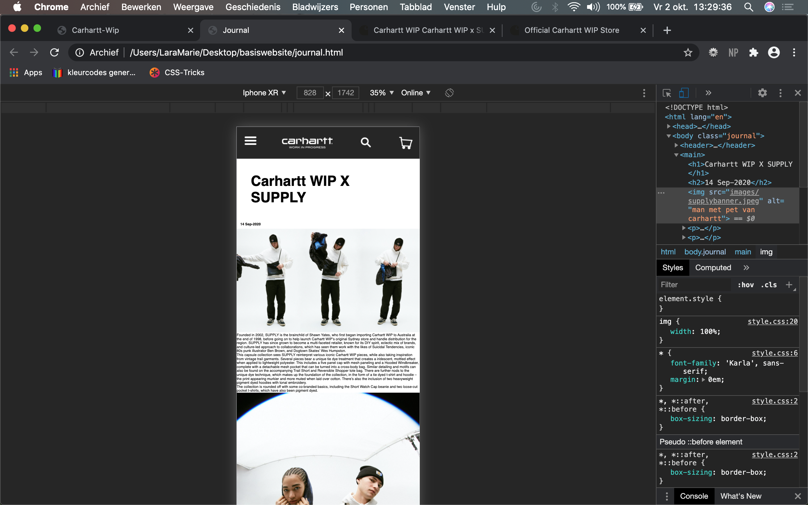
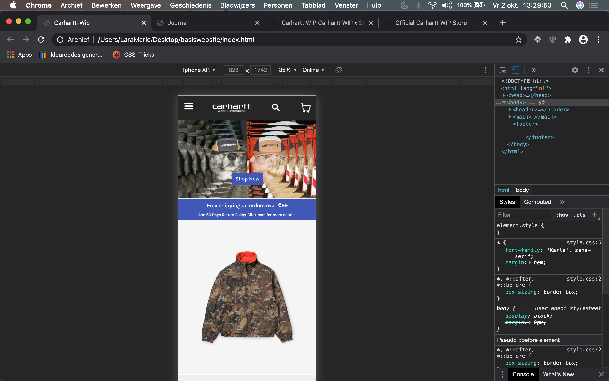

### Agenda voor meeting
Keyframes
Grids
Feedback

### Verslag van meeting

## Voortgang 1 (week 3)

### Stand van zaken

Ik vond/vind het erg lastig om de afbeeldingen zonder buttons te achterhalen omdat je deze niet kunt screenshotten zonder de buttons, hierdoor heb ik een button over de afbeelding geplaatst zodat het wel klikbaar kan worden.

Ik vond het wel leuk om te doen maar erg veel omdat we ook opdrachten voor javascript moesten en daar heb ik iets meer moeite mee. Ook hadden we deadlines voor meerder vakken dus ik heb alleen een kort begin nog maar kunnen maken aan de eindopdracht.

-- 

Na de les heb ik de afbeelding kunnen fixen en veranderd zodat het nu weer kopt. Ook ben ik begonnen met de slideshow aan t begin met javascript.

**Screenshot(s):**

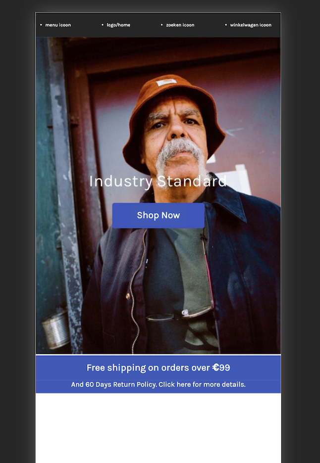

### Agenda voor meeting

We hadden het verkeerd begrepen en allemaal kleine vragen per persoon op papier opgeschreven.

Zelf had ik vragen over het goed opslaan van afbeeldingen en een hamburgermenu.

### Verslag van meeting

We hebben kleine vragen van iedereen kunnen beantwoorden, we hebben tips gekregen van een uitklap menu die erg handig waren. Echter twijfel ik persoonlijk nog of ik die ga gebruiken. Ook hebben we het nog kort over positionering van afbeeldingen gehad.

## Intake (week 1)

**Je startniveau:** Rood voor HTML/CSS en Blauw voor Javascript

**Je focus:** responsive

**Je opdracht:** https://www.carhartt-wip.com/en

**Screenshot(s):** 

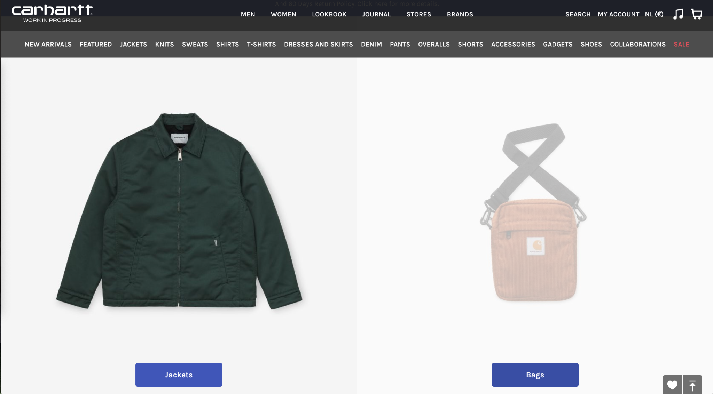

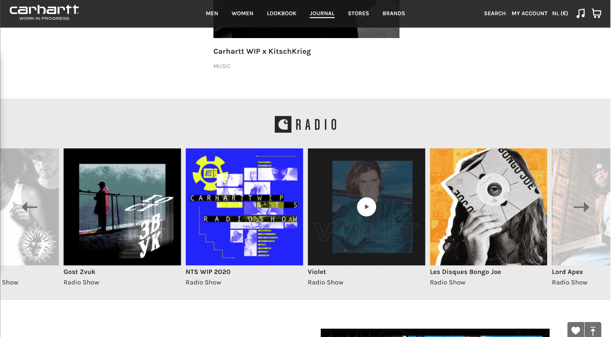

**Breakdown-schets(en):**

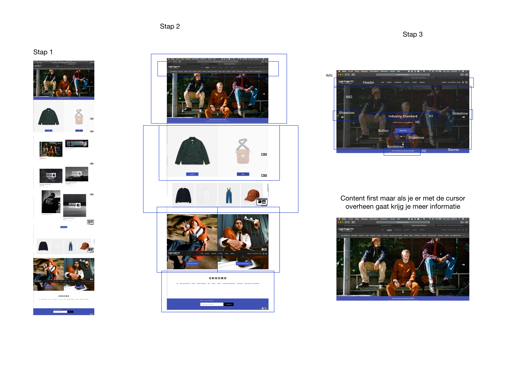

Omdat ik desktop versie had gedaan heb ik deze nogmaals van de mobiel gedaan.

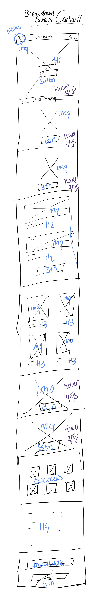

